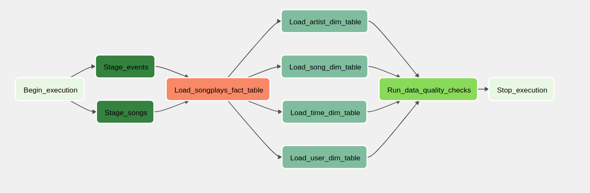
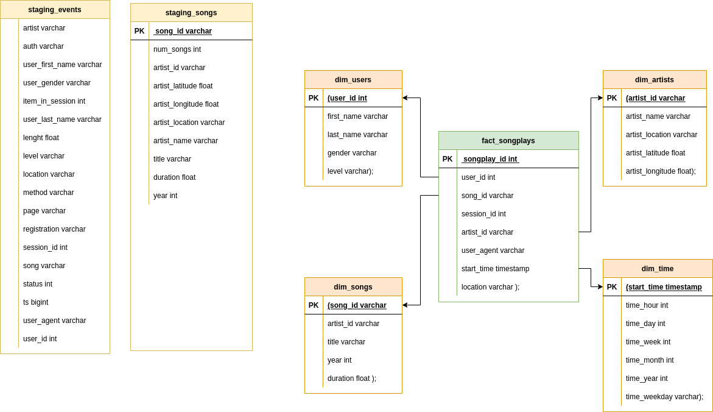
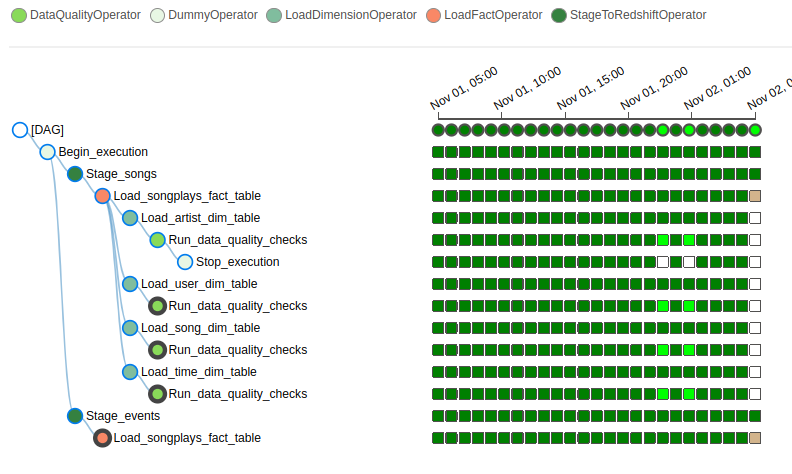

# Sparkify Airflow
A music streaming company, Sparkify, has decided that it is time to introduce more automation and monitoring to their data warehouse ETL pipelines. The best tool to create high grade data pipelines that are dynamic and built from reusable tasks, can be monitored, and allow easy backfills is Apache Airflow.

The source data resides in S3 and needs to be processed in Sparkify's data warehouse in Amazon Redshift. The source datasets consist of JSON logs that tell about user activity in the application and JSON metadata about the songs the users listen to.

## Prerequisites
* Create an IAM User in AWS.
    *  Open IAM.pdf and Create and IAM User in AWS
* Create a redshift cluster in AWS.
    *  Open Redshift.pdf and Create an AWS Redshift Cluster

## Setting up Connections
* Connect Airflow and AWS
    * Open Airflow-AWS.pdf and connect Airflow to AWS
* Connect Airflow to the AWS Redshift Cluster
    * Open Airflow-Redshift.pdf and connect Airflow to AWS Redshift

## How to Run (Step-by-Step)
* Go to the project folder and initialize the docker containers
    * Setting the right Airflow user
     ```
        mkdir -p ./logs 
        echo -e "AIRFLOW_UID=$(id -u)" > .env
    ```
    * open the terminal and Initialize the database
     ```
        docker-compose up airflow-init
    ```
    * open another the terminal and run airflow
     ```
        docker-compose up
    ```    

*   In Airflow-Web go to create_tables_sparkify dag unpaused dag and trigger dag. This dag is responsible for creating the tables in Redshift.

*   In Airflow-Web go to sparkify_airflow dag unpaused dag and trigger dag. This dag allow run sparkify pipelines at regular intervals and provides an easy view for monitoring the results of pipeline runs and debugging any failures that may have occurred.


## Airflow DAG


 * The stage operator is expected to be able to load any JSON formatted files from S3 to Amazon Redshift.
 * With dimension and fact operators, you can utilize the provided SQL helper class to run data transformations.
 * Data quality operator, is used to run checks on the data itself.

## Redshift Schema

 
 * The data modeling chosen was the star schema. Among the main advantages we can mention: good response time, script run time, flexibility in the model, low complexity in the model.

## Checking Airflow 

